# LINQPad: 每個.NET工程師都要有的一隻箭
對於`.NET`的工程師來說最幸福的就是我們有史上最強的IDE: **Visual Studio**，隨便你要上山還是下海，用著Visual Studio就像是開著蝙蝠車一樣橫行天下。 

**But!!** 強大如Visual Studio也是有缺點的，例如說某天布魯斯要去公司露個臉，總不能開著蝙蝠車去吧，這時在車庫裡的藍寶堅尼就派上用場了，這台藍寶堅尼就是我們本篇的主角**LINQPad**。

## 本篇目標
介紹LINQPad的以下主題: 
* 用途
* 介面
* 用法: Expression、Statement(s)及Program
* 與資料庫連線
* Extension Methods
* 小撇步

## 用途
如果上面的故(廢)事(文)所說的，LINQPad之於Visual Studio就像是跑車之於戰車一樣，Visual Studio的功能強大，要做任何事情都難不倒它，但缺點就是太笨重了，消耗的資源太多，如果我們只是要做一些程式片段的驗證測試或是學習還要開啟Visual Studio然後創建專案，光是想到就會讓人卻步，這時候LINQPad就派上用場了，它有下列的優點: 
* 它很輕盈(15MB)
* 有Portalble版本不用安裝可以帶著走，想在哪寫就在哪寫
* 可以不用建立專案甚至只要寫你想要測試的程式碼即可(Expression、Statement)
* 可以把程式碼片段(snippet)存起來當作範例使用

接下來我們來看看要怎麼使用LINQPad吧。

## 介面
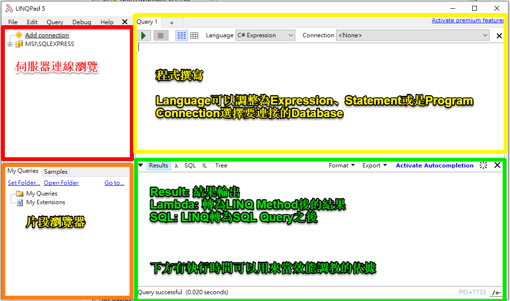

介面分為四個部分: 
* 伺服器連線瀏覽: 跟SSMS的Object Explorer一樣，連線後可以看到各個Database的相關資訊
* 片段瀏覽器: 個人儲存的程式碼片段及LINQPad提供的範例程式片段
* 程式撰寫: 撰寫程式片段
* 執行結果
    * Result: 查詢結果(LINQPad提供Dump來得到較好的顯示品質)
    * Lambda: LINQ轉為LINQ Method後的程式
    * SQL: LINQ轉出的SQL Query

對介面有初步的認識後我們就來用LINQPad寫一些程式吧。

## 用法
對於C#，LINQPad有三種用法即它的使用場景:
* Expression: 在單行程式或是單個LINQ陳述式
* Statement(s): 多行的程式片段
* Program: 需要撰寫Class或是Method時

### Expression
* **使用場景**: 演練某個剛認識的Method時、要以LINQ取得想要的資料時...
* **使用方式**: 以單行程式碼的方式撰寫，最後不用加分號(`;`)
* **範例**:
1. 想要輸出期望的日期格式時([範例取自此](https://www.linqpad.net/CodeSnippetIDE.aspx))
```C#
DateTime.Now.ToString("yyyy/MM/dd")
```
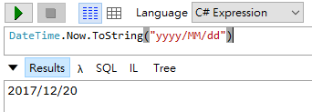

可以看到Result直接輸出結果，在測試或學習Method時很好用。

2. 以LINQ查詢一段句子每個字的長度時(範例取自LINQPad>Samples>LINQPad Tutorial & Reference>5-minute induction>A simple query expression)
```C#
from word in "The quick brown fox jumps over the lazy dog".Split()
orderby word.Length
select word
```
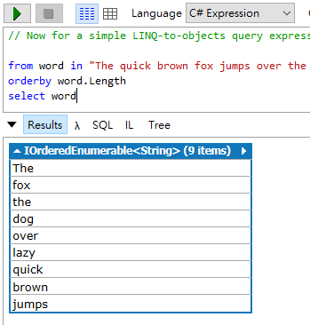

就算是分成多行，只要還是一個陳述式就算是Expression。對於要找出期望的資料很好用。

### Statement(s)
* **使用場景**: 有段程式碼需要做測試，或是順一下程式的邏輯時...
* **使用方式**: 不用加上`class`，直接寫入程式碼片段，每行程式碼結束時要加上分號(`;`)
1. 一個以上的LINQ查詢所組成的資料時(範例取自LINQPad>Samples>LINQPad Tutorial & Reference>5-minute induction>Multiple statements)
```C#
var words =
	from word in "The quick brown fox jumps over the lazy dog".Split()
	orderby word.ToUpper()
	select word;
	
var duplicates =
	from word in words
	group word.ToUpper() by word.ToUpper() into g
	where g.Count() > 1
	select new { g.Key, Count = g.Count() };	
```

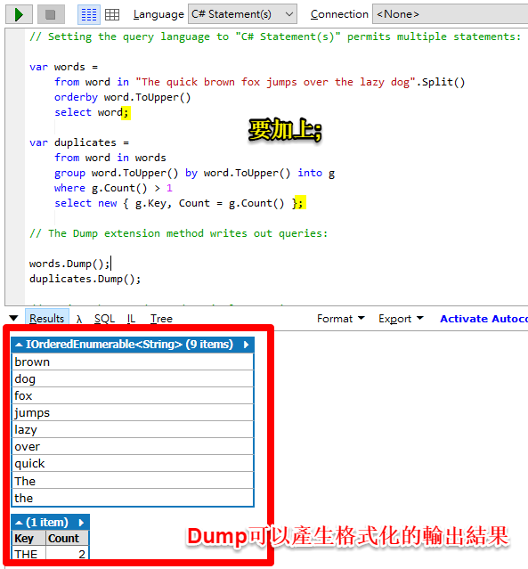

### Program
* **使用場景**: 需要演示Method、Function或是Class
* **使用方式**: 跟寫Console App一樣的方式
1. 有個Method/Class要做測試時
```C#
void Main()
{
	Test t = new Test();
	t.Hello().Dump();
	World().Dump();
}

string World(){
	return "World";
}

class Test{
	public string Hello(){
		return "Hello";
	}
}
```


你沒看錯!!一般來說`Main()`是在`Program Class`內的，而LINQPad可以忽略且直接在外面寫上Class或是Method。

## 與資料庫連線
在沒有LINQPad的幫助下，我們要測試用LINQ抓取的資料庫資料是否正確時，我們需要做下面兩件事:
1. 取得連線字串
1. 開啟連線

接著我們才能開始撰寫LINQ，這一來一往間就耗掉了許多的時間，這時就該是LINQPad出場的時候了。

### 設定連線
現在我們要幫LINQ設定好DB的連線方式。

1. 左上方區塊裡按下Add connection，跳出的視窗裡直接按下next

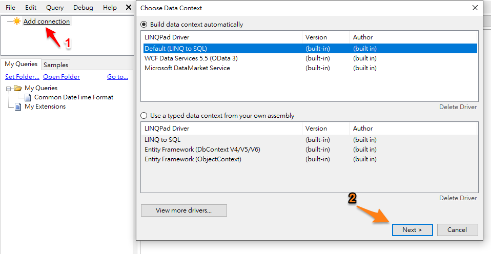

2. 進入下一個頁面，這裡跟連線SSMS的設定相同，設定好後按下OK(也可以按Test測試連線是否正確)

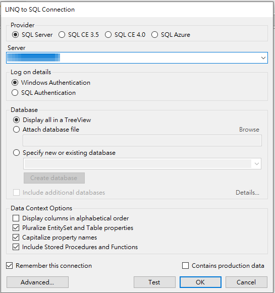

3. 連線完成後就可以在左上的區塊看到Database，我們的**Northwind**出現了~

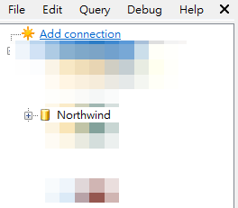

### 使用資料庫資料做LINQ演練
這小節要來利用上一節取得的資料庫來做LINQ演練。

1. 在上一節取到的**Northwind**按右鍵`Use in Current Query`


2. 連線成功後可以看到程式碼區塊上的Connection變成**Northwind**


3. 接著我們來寫個LINQ(此範例為LINQPad>Samples>LINQPad Tutorial & Reference>5-minute induction>What about querying a database!)，執行後我們可以看到我們夢寐一求的資料了~~

```C#
from p in Products
let spanishOrders = p.OrderDetails.Where (o => o.Order.ShipCountry == "Spain")
where spanishOrders.Any()
orderby p.ProductName
select new
{
	p.ProductName,
	p.Category.CategoryName,
	Orders = spanishOrders.Count(),	
	TotalValue = spanishOrders.Sum (o => o.UnitPrice * o.Quantity)
}
```

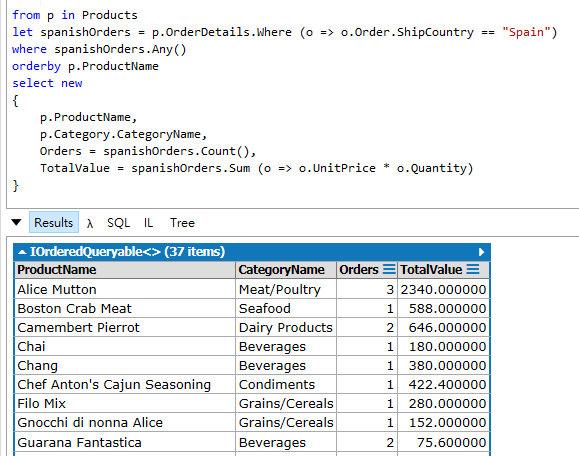

## Extension Methods
有時候我們會想要寫個可以在全部的程式碼片段使用的通用Method，這時LINQPad的Extension Method就派上用場了，在`MyExtensions`這個Class中撰寫Method就可以在每個程式碼片段中做使用(就像是LINQPad內建的Dump一樣)。

1. 在左下的區塊中的**My Queries**的Tab>My Extensions，程式碼區塊會出現`MyExtensions`的Class


2. 接著我們來加入`Hello`到`MyExtensions`中
```C#
public static void Hello()
{
	Console.Write("Hello");
}
```

3. 新開一個Query執行Method
```C#
MyExtensions.Hello();
```

4. 現在我們再加一個`ConsoleWriteLine`
```C#
public static void ConsoleWriteLine(this string str)
{
	Console.WriteLine(str);
}
```

5. 在剛剛的Query中呼叫`ConsoleWriteLine`，最後就會像下圖一樣

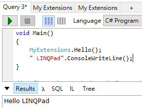

### 小節
Extension Methods的好處在於你可以擴充自己的Infrastructure，來縮減每個程式碼片段有可能重複的處理。

## 小撇步
### 儲存可參考的程式碼片段

有時候我們會常常參考某些好用的程式碼，這時就會想要找個地方存起來等要的時候再拿出來。

在LINQPad中有儲存程式碼片段的功能:
1. 在要儲存的片段的Tab上按右鍵>Save(或ctrl+s)。
1. 儲存後在左下角MyQueries就會看到剛剛儲存的檔案了。

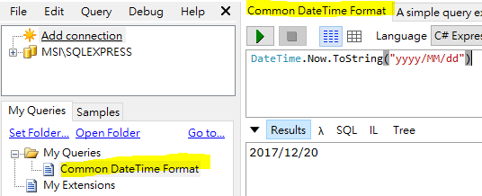

### 快捷鍵表
在`Help>Keyboard/Mouse Shortcuts`可以打開快捷鍵表

### 執行選取的程式碼
選取想要執行的片段按下`執行`或是`F5`就可以執行片段程式碼

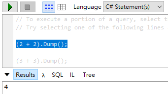

### LINQPad extension methods
LINQPad自己有提供Dump，讓開發者可以更產出更清楚的結果，關於Dump的詳細說明可以參考作者自己在StackOverflow的回答: [LINQPad extension methods](https://stackoverflow.com/a/3562160)。

## 結論
LINQPad是一個**麻雀雖小，五臟俱全**的開發工具，在這個章節中我們學到了如何運用這功能強大的工具，下個章節我們要來找尋`foreach`中所隱藏的秘密。