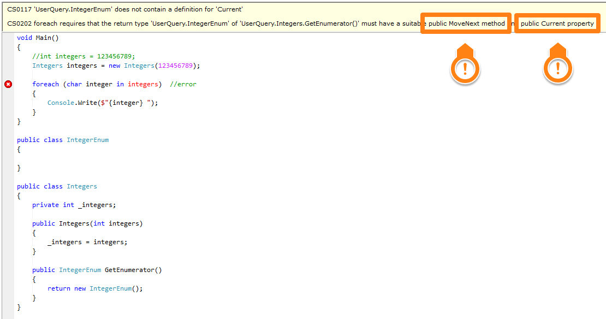

# 藏在`foreach`下的秘密: `foreach`原理說明
在開始使用LINQ之後，以前大量使用的`foreach`已經慢慢的淡出了我的螢光幕前...，我其實一直都沒意識到這一點，直到我在構思這次的文章時，才又想起了這昔日的好戰友，究竟為什麼會因為使用了LINQ而減少了`foreach`使用的次數呢?讓我們繼續看下去。

## 嘗試的第一步
總而言之我們先寫一個`foreach`的範例:

```C#
int[] integers = new int[] { 1, 2, 3, 4, 5, 6, 7, 8, 9 };

Console.WriteLine($"Is Array: {integers is Array}"); //Is Array: true

foreach (int integer in integers)
{
    Console.Write($"{integer} ");
} // 1 2 3 4 5 6 7 8 9 
```

這個是巡覽一個1~9數字的陣列，然後把這些數字印到終端的範例。

非常簡單的範例，但卻帶出了不簡單的疑問: **為什麼foreach知道要怎麼做巡覽?**，可能有人已經發現我有個提示在程式碼裡:

```C#
Console.WriteLine($"Is Array: {integerArray is Array}"); //Is Array: true
```

**因為`integers`是`Array`!!**，嗯...這個答案是對也是不對，因為其實有其他非Array的物件也是可以用    `foreach`來做巡覽的，例如我改為下面這樣子: 

```C#
String integers = "123456789";

Console.WriteLine($"Is Array: {integers is Array}"); //Is Array: false

foreach (char integer in integers)
{
    Console.Write($"{integer} ");
} // 1 2 3 4 5 6 7 8 9 
```

把`integers`從`int[]`改為`String`照樣還是可以做巡覽，這是為什麼呢?

## 從錯誤中學習
**失敗為成功之母**這句話在寫程式時一直在應證，我們總是在**Try and error**下成長，現在我們要再來嘗試這個解決之道了。

首先要想辦法讓`foreach`出錯，我們先塞個`int`給它看看會發生什麼事: 

```C#
int integers = 123456789;

foreach (int integer in integers)	//error
{
    Console.Write($"{integer} ");
}
```


**YA!!** 發生錯誤: *because 'int' does not contain a public definition for **'GetEnumerator'***，找到關鍵字，原來是沒有定義`GetEnumerator`，那我們就來加上定義: 
```C#
public class IntegerEnum
{

}

public class Integers
{
    private int _integers;

    public Integers(int integers)
    {
        _integers = integers;
    }

    public IntegerEnum GetEnumerator()
    {
        return new IntegerEnum();
    }
}
```

我們自定義一個`Integers`，有實作`GetEnumerator`，`GetEnumerator`不知道要傳回什麼，就先傳回一個什麼都沒有的`IntegerEnum`。

接著把`integers`的型別改成我們自定義的`Integers`: 

```C#
//int integers = 123456789;
Integers integers = new Integers(123456789);
```

再來看看會發生什麼事: 



又發生錯誤了: ***'UserQuery.IntegerEnum'** of 'UserQuery.Integers.GetEnumerator()' must have a suitable **public MoveNext method** and **public Current property***。

這回問題是發生在我們自定義的`IntegerEnum`上，它叫我們實作`MoveNext`方法跟`Current`屬性，看到這邊我突然想到了什麼，這不就是[Iterator Pattern](https://en.wikipedia.org/wiki/Iterator_pattern)嗎?

我們之後再來講解原理，先把`Integers`完成:
```C#
public class IntegerEnum
{
    private int _integers;
    private int _index;
    private int _maxDigit;
    public int Current { get; private set; }

    public IntegerEnum(int integers)
    {
        _integers = integers;
        _index = 0;
        _maxDigit = (int)Math.Log10(integers);
    }

    public bool MoveNext()
    {
        if (_maxDigit < _index) return false;

        Current = getCurrent();
        _index++;

        return true;
    }

    private int getCurrent()
    {
        int currentDigit = _maxDigit - _index;
        int result = (_integers / (int)Math.Pow(10, currentDigit)) % 10;  //Get first digit

        return result;
    }
}

public class Integers
{
    private int _integers;

    public Integers(int integers)
    {
        _integers = integers;
    }

    public IntegerEnum GetEnumerator()
    {
        return new IntegerEnum(_integers);
    }
}
```

這樣一來我們就可以用`Integer`取得我們想要的資料了。

## 原理
費了一番心力，終於把1-9的數字給印出來了，但是他是怎麼運作的呢?我們現在就來瞧瞧吧。

### Iterator Pattern
`foreach`的實作是`Iterator Pattern`，下圖為**UML圖**: 


在範例程式中分別對應: 
* **ConcreteAggregate**: Integers
    * **Iterator()**: GetEnumerator()
* **ConcreteIterator**: IntegerEnum
    * **next()**: 傳回下一個元素，在C#中是以`Current`來抓出目前元素
    * **hasNext()**: 確認是否有下一個元素，在C#中是由`MoveNext()`做確認

在`Iterator`裡有個跟C#上的實作差異: 
* 在`Ierator Pattern`上是用`hasNext()`判斷是否有下一個元素，確定有了再Call `Next()`取得元素並更新`index`
* c#裡是用`MoveNext()`判斷是否有下一個元素，確定有了之後去更新`Current`及`index`

到這裡應該對`foreach`的運作上應該有個基本的認識了，但是我又會想問問題了: **那UML上方的Aggregate跟Iterator呢?**

## IEnumerable and IEnumerator
千呼萬喚始出來，我們整個主題的重點隆重登場，**IEnumerable**及**IEnumerator**，它們其實就是UML上方的那兩塊:
* **Aggregate**: IEnumerable(ConcreteAggregate的介面)
* **Iterator**: IEnumerator(ConcreteIterator的介面)

所以我們的`Integers`其實就是實作了`IEnumerable`，而`IntegerEnum`就是實作了`IEnumerator`，現在我們來把這兩個介面加到剛剛的例子中: 

```C#
public class IntegerEnum : IEnumerator
{
    ...

    public object Current { get; private set; }

    public bool MoveNext()
    {
        if (_maxDigit < _index) return false;

        Current = getCurrent();
        _index++;

        return true;
    }

    public void Reset()
    {
        _index = 0;
    }

    ...
}

public class Integers : IEnumerable
{
    ...

    public IEnumerator GetEnumerator()
    {
        return new IntegerEnum(_integers);
    }
}
```

這也是為什麼`String`、`Array`、`List`...等物件可以被foreach所解譯，因為這些物件都有繼承`IEnumerable`。

## 運作
依照[C# Spec](https://docs.microsoft.com/zh-tw/dotnet/csharp/language-reference/language-specification/statements)的foreach statement說明，我們可以知道一段foreach的程式碼會被定義為下面這樣: 
```C#
foreach (V v in x) embedded_statement
```

它會被擴充為:
```C#
{
    E e = ((C)(x)).GetEnumerator();
    try {
        while (e.MoveNext()) {
            V v = (V)(T)e.Current;
            embedded_statement
        }
    }
    finally {
        ... // Dispose e
    }
}
```

跟剛剛的例子對照: 
* **V**: `int`
* **v**: `integer`
* **x**: `integers`
* **embedded_statement**: `Console.Write($"{integer} ");`
* **C**: Collection Type: `Integers`
* **E**: Enumerator Type: `IntegerEnum`
* **T**: element Type: `Integer`

從這裡就可以明顯的看出來`foreach`其實就會被轉譯為`Iterator Pattern`的場景物件(Client)。

## 結語
終於把謎題解開了，為什麼我們使用了LINQ就會減少使用foreach，就是因為它們都是做同樣的事情，所以本來我們需要用foreach處理資料集時，用LINQ也可以處理，自然而然好用的LINQ就變成我們的主角啦。

## 範例程式
[GitHub](https://github.com/peterhpchen/DigDeeperLINQ/tree/04_foreach/demo/04_foreach)

## 參考
* [twmht-Iterator Pattern](http://twmht.github.io/blog/posts/design-pattern/iterator.html)
* [Wiki-Iterator pattern](https://en.wikipedia.org/wiki/Iterator_pattern)
* [MSDN-IEnumerable.GetEnumerator](https://msdn.microsoft.com/zh-tw/library/system.collections.ienumerable.getenumerator(v=vs.110).aspx)
* [StackOverflow-How do foreach loops work in C#?](https://stackoverflow.com/a/398996)
* [In91-[.NET]快快樂樂學LINQ系列前哨戰－IEnumerable, IEnumerator, yield, Iterator](https://dotblogs.com.tw/hatelove/2012/05/10/introducing-foreach-ienumerable-ienumerator-yield-iterator)
