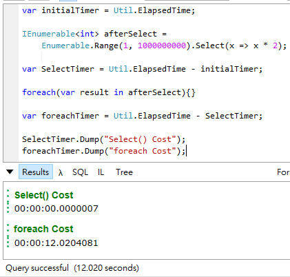

# Select的應用
前面累積了這麼多的觀念，現在終於要用上了，我們要來正式介紹第一個標準查詢運算子-Select。

## 功能說明
Select運算子可以將集合中的每一個元素以新的形式輸出。

## 查詢運算式
我們先來看看一個Select的查詢運算式的表示方式: 
```C#
from x in Products
select x.ProductName
```
* 第一行的from是將產品(Products)這個集合上的每一個元素以x來表示
* 第二行的select代表說要將每一個元素(x)的產品名稱(ProductName)輸出

當有多個資料想要藉由select輸出時，也可以用Anonymous types和Object Initializer來達到此目的: 
```C#
from x in Products
select new {x.ProductName, x.UnitPrice}
```

## 方法定義
Select有兩個Public的方法如下: 
```C#
public static IEnumerable<TResult> Select<TSource, TResult>(this IEnumerable<TSource> source, Func<TSource, TResult> selector);

public static IEnumerable<TResult> Select<TSource, TResult>(this IEnumerable<TSource> source, Func<TSource, int, TResult> selector)
```

上述這兩個方法的差別在於`Selector`，這個委派([第六章有說明](06_Lambda.md))的定義在兩種方法上差了一個int的傳入參數，這個int其實就是集合的index，LINQ提供這樣的參數讓工程師使用起來更加便利。

Selector其實就是你想要對每一個元素所做的事情以方法來表述

## 例子
我們將剛剛的查詢運算式例子轉為方法來看看: 
```C#
// Using query expression syntax.
var query = from x in Products
select new {x.ProductName, x.UnitPrice};

// Using method-based query syntax.
var method = Products
   .Select (
      x => 
         new  
         {
            ProductName = x.ProductName, 
            UnitPrice = x.UnitPrice
         }
   );
```
在這個例子的比對中我們可以發現: 
* Query的from的目的就是要確定資料來源及其別名
* Query的Select後面接的其實就是Lambda expression

現在我們來看一個有index的例子(例子節錄自[Microsoft Docs](https://docs.microsoft.com/en-us/dotnet/api/system.linq.enumerable.select?view=netframework-4.7.1)): 
```C#
string[] fruits = { "apple", "banana", "mango", "orange", 
                      "passionfruit", "grape" };

var query =
    fruits.Select((fruit, index) =>
                      new { index, str = fruit.Substring(0, index) });

foreach (var obj in query)
{
    Console.WriteLine("{0}", obj);
}

/*
 This code produces the following output:

 {index=0, str=}
 {index=1, str=b}
 {index=2, str=ma}
 {index=3, str=ora}
 {index=4, str=pass}
 {index=5, str=grape}
*/
```
我們可以看到這個index的資訊也會進入每一個元素中，幫助工程師做資料上的處理。

接下來下面這個例子讓各位猜猜會不會跑很久: 
```C#
IEnumerable<int> afterSelect =
	Enumerable.Range(1, 1000000000).Select(x => x * 2);
```
這是產生一個1到1000000000的數列，每個元素輸出兩倍的數字。

如果還不知道的話，沒關係，再給一個提示，那我對afterSelect做foreach的花費是多還是少呢?
```C#
foreach(var result in afterSelect){}
```
下面是比較結果: 



Select少了很多對吧，其實Select它有延遲執行的特性，意思是說你叫用它時，它不會馬上去巡覽所有的元素，而是會等到你叫用GetEnumerator()或是foreach時才會去變動集合，詳細的原理我們留到下章在深入討論。

## 所有查詢的起點
記得以前在看LINQ的相關介紹時，第一章出現的幾乎都是Select，它究竟有什麼重要性而讓它常保開場的位子呢?。

現在我們來想想: 一段查詢語法它的基本要件是什麼? 是什麼可以讓這段文字產生查詢的能力? 首先我們會想到的是**選取資料來源**，沒有資料來源根本也不用做查詢了，那有了資料來源後還欠缺什麼呢? 最直覺的就是**目標資料的結構**了，所以Select它是一個最直覺的查詢功能，從SQL的查詢與法也可以看出來。

所以謎底揭開了，因為人習慣以最直覺的開始講起，這樣的講述方式會讓人比較快熟悉並且進入狀況，所以Select自然變成每個作者筆下的第一頭牌了

但是Select在LINQ的語法中其實不一定會出現，讓我們來看看下面的例子: 
```C#
from x in Products
group x by x.CategoryID
```


這裡請了group出來代班一下，我們可以看到這裡並沒有select，但這還是一個正確的查詢運算式，其實在[C#語言規格](https://docs.microsoft.com/zh-tw/dotnet/csharp/language-reference/language-specification/expressions#query-expressions)中在介紹Query Experssions的章節有提到下面這段解釋: 
> A query expression begins with a `from` clause and ends with either a `select` or `group` clause.

所以我們的一段最基本的查詢運算式會以`from`開頭，`select`或`group`結尾。

上面的定義是在說查詢運算式，在標準查詢運算子上的規則又更為寬鬆了，因為它本身的回傳值是`IEnumerable`所以你只要是對其做事的方法都可以使用，也不用一定要先執行某個方法才能做查詢。

## 結語
這章講述了Select的Query及Method的用法，下一章我們來深入的探討Select的運作。

## 參考
* [Microsoft Docs-system.linq.enumerable.select](https://docs.microsoft.com/en-us/dotnet/api/system.linq.enumerable.select?view=netframework-4.7.1)
* [Microsoft Docs-expressions#query-expressions](https://docs.microsoft.com/zh-tw/dotnet/csharp/language-reference/language-specification/expressions#query-expressions)
* [Microsoft Docs-classification-of-standard-query-operators-by-manner-of-execution](https://docs.microsoft.com/en-us/dotnet/csharp/programming-guide/concepts/linq/classification-of-standard-query-operators-by-manner-of-execution)