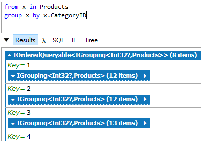

# Select的應用
前面累積了這麼多的觀念，現在終於要用上了，我們要來正式介紹第一個LINQ語法`Select`了。

## 格式說明
在應用的單元裡文章會被分為幾個小節: 
* 功能說明: 語法的功用
* 方法定義: 語法的方法定義
* 查詢運算式: 此語法的運算是使用方法
* 方法範例: 使用各個方法實作例子
* 特別之處: 語法的特性說明

因應不同的語法章節內容會有微調。

## 功能說明
`Select`運算子可以將集合中的**每一個元素以新的形式輸出**，其用法與SQL的`Select`相似。

## 方法定義
Select有兩個Public的方法如下: 
```C#
public static IEnumerable<TResult> Select<TSource, TResult>(this IEnumerable<TSource> source, Func<TSource, TResult> selector);

public static IEnumerable<TResult> Select<TSource, TResult>(this IEnumerable<TSource> source, Func<TSource, int, TResult> selector)
```

`Select`只有一個傳入參數`Selector`，這個參數是一個[委派](06_Lambda.md)參數，而傳入的方法其實就是你想要對每一個元素什麼樣的事情。

兩種方法的差別在於第二個委派參數`Selector`，兩個委派方法差了一個`int`傳入參數，這個`int`其實就是集合的`index`，工程師可以利用這個傳入參數取得目前元素在集合中的位置。

## 查詢運算式
依照[C# Spec](https://docs.microsoft.com/en-us/dotnet/csharp/language-reference/language-specification/expressions#query-expressions)上的語法定義如下: 
```antlr
select_clause
    : 'select' expression
    ;
```
* `expression`: 在每個元素上你要取得的資料物件

看定義很難懂對不對? 我們先來看個例子吧: 
```C#
from x in Products
select x.ProductName
```
* 第一行的`from`是將產品(Products)這個集合上的每一個元素以`x`來表示
* 第二行的`select`代表說要將每一個元素(x)的產品名稱(ProductName)輸出

當有多個資料想要藉由`select`輸出時，也可以用**Anonymous types和Object Initializer**來達到此目的: 
```C#
from x in Products
select new {x.ProductName, x.UnitPrice}
```

看到這裡我們知道`expression`其實就是一個變數或是一個類別，而這個變數(或類別)就是你期望在每個元素上取得的資料。

## 例子
看過[前一章](08_WhatIsLINQ.md)的介紹可以知道，其實**查詢運算式會轉換成標準查詢運算子**，現在我們就用上節的查詢運算式例子轉換成標準查詢運算子看看: 
```C#
// Using query expression syntax.
var query = from x in Products
select new {x.ProductName, x.UnitPrice};

// Using method-based query syntax.
var method = Products
   .Select (
      x => 
         new  
         {
            ProductName = x.ProductName, 
            UnitPrice = x.UnitPrice
         }
   );
```

在這個例子的比對中我們可以發現: 
* Query的`from`的目的就是要確定**資料來源**及其在**Lambda運算式中的別名**
* Query的`Select`後面接的其實就是**Lambda expression**

上面的例子沒有使用到`index`這個參數，現在我們來看個有`index`的例子: 
```C#
string[] data = { "No1", "No2", "No3", "No4", "No5"};

var query =
    data.Select((item, index) => new { index, item });

foreach (var obj in query)
{
    Console.WriteLine("{0}", obj);
}

/*
 * { index = 0, item = No1 }
 * { index = 1, item = No2 }
 * { index = 2, item = No3 }
 * { index = 3, item = No4 }
 * { index = 4, item = No5 }
*/
```
我們可以看到這個`index`的資訊也會進入每一個元素中，對於需要知道元素位置的處理很有幫助。

## 特別之處
Select這個看似平凡的語法其實也藏有一些玄機及特色，接下來我們就來看看吧。

### Select效率超高?
下面這個例子讓各位猜猜會不會跑很久: 
```C#
IEnumerable<int> afterSelect =
	Enumerable.Range(1, 1000000000).Select(x => x * 2);
```
這例子是**產生一個1到1000000000的數列，每個元素輸出兩倍的數字**。

如果認為會跑很慢的人，沒關係，這邊再給一個提示: 接下來**對`afterSelect`做`foreach`的花費是多還是少**呢?
```C#
foreach(var result in afterSelect){}
```

下面是比較結果: 


Select少了很多對吧，其實Select它有**延遲執行**的特性，意思是說你叫用它時，它不會馬上去巡覽所有的元素，而是會等到你叫用`GetEnumerator()`或是`foreach`時才會去變動集合，詳細的原理我們留到之後再深入討論。

### Select是所有查詢都必備的語法嗎?
記得以前在看LINQ的相關介紹時，第一章出現的幾乎都是Select，所以我一直以為它是一個Query Expressions的基本，就像是`from`一樣，你是不是也跟我的想法一樣呢? 如果是的話請繼續往下看。

現在我們來想想: 一段查詢語法它的基本要件是什麼? 是什麼可以讓這段文字產生查詢的能力? 首先我們會想到的是**選取資料來源**，沒有資料來源根本也不用做查詢了，那有了資料來源後還欠缺什麼呢? 最直覺的就是**目標資料的結構**了，所以`Select`它是一個最直覺的查詢功能，從SQL的查詢與法也可以看出來。

所以**Select幾乎都會在文章的開頭出現**的謎底揭開了，因為人習慣以最直覺的開始講起，這樣的講述方式會讓人比較快熟悉並且進入狀況，所以`Select`自然變成每個作者筆下的第一頭牌了。

那另一個問題浮現了: **它是一個Query Expressions的必備語法嗎?** 其實Select在LINQ的語法中其實**不一定需要出現**，讓我們來看看下面的例子: 
```C#
from x in Products
group x by x.CategoryID
```



這裡請了`group`出來代班一下，我們可以看到這裡並沒有select，但這還是一個正確的查詢運算式，其實在[C#語言規格](https://docs.microsoft.com/zh-tw/dotnet/csharp/language-reference/language-specification/expressions#query-expressions)中在介紹Query Experssions的章節有提到下面這段解釋: 
> A query expression begins with a `from` clause and ends with either a `select` or `group` clause.

所以我們的一段最基本的查詢運算式會以`from`開頭，`select`或`group`結尾，是不是顛覆了以往的想像呢?

上面的定義是在說**查詢運算式**，在**標準查詢運算子**上的規則又更為寬鬆了，因為它本身的回傳值是`IEnumerable`所以你只要是對其做事的方法都可以使用，也不用一定要先執行某個方法才能做查詢。

## 結語
這章講述了Select的Query及Method的用法，在下一章學習如何建置**corefx**後就可以來看看`Select`內到底在做什麼了。

## 參考
* [Microsoft Docs-system.linq.enumerable.select](https://docs.microsoft.com/en-us/dotnet/api/system.linq.enumerable.select?view=netframework-4.7.1)
* [Microsoft Docs-expressions#query-expressions](https://docs.microsoft.com/zh-tw/dotnet/csharp/language-reference/language-specification/expressions#query-expressions)
* [Microsoft Docs-classification-of-standard-query-operators-by-manner-of-execution](https://docs.microsoft.com/en-us/dotnet/csharp/programming-guide/concepts/linq/classification-of-standard-query-operators-by-manner-of-execution)