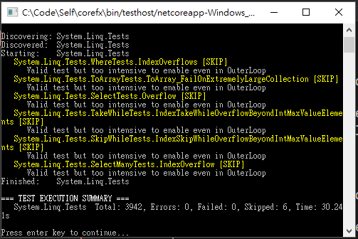

# 建置dotnet/corefx
之前在介紹工具及資源時，有提到[dotnet/corefx](https://github.com/dotnet/corefx)是我們的地圖，因為裡面有LINQ的原始碼，在正式挑戰地下城之前讓我們來看看這個地圖到底要怎麼使用吧。

## 建置
依照[Developer Guide](https://github.com/dotnet/corefx/blob/master/Documentation/project-docs/developer-guide.md)的步驟建置Repository，本篇以**Windows**為例。

### 在建置之前
**corefx**的建置會依賴某些軟體，這些軟體需要先安裝才能建置專案。

1. 安裝Visual Studio 2015/2017，以2017版本為例，需要安裝下圖勾選的套件: 


1. 安裝[CMake](https://cmake.org/download/)

### 開始建置
開發團隊很貼心地幫我們準備了建置相關的script，我們只要執行相對應的script就可以完成建置，主要有以下幾個scripts: 

* clean:  清空建置所產生的相關檔案，跟Visual Studio中的*Clean Solution*相似
* sync:  取得在建置過程中需要的檔案，像是build tools、xunit、coreclr...等等
* build: 建置**corefx**
* build-tests: 建置及執行測試案例

我們先執行build: 
* 開啟**cmd**或是**PowerShell**，移至存放corefx原始碼的資料夾後鍵入`build`

執行完之後在Visual Studio上打開*corefx/src/System.Linq.sln*: 
1. 在Solution Explorer對Solution按右鍵點擊*Clean Solution*
1. 在Solution Explorer對Solution按右鍵點擊*Build Solution*

這樣我們的建置就完成了。

### 執行測試程式
*corefx*有很多測試案例，在學習的時候很有幫助，接著我們要來跑跑看測試案例。

* 方案下有一個*tests*的資料夾，對裡面的System.Linq.Tests按右鍵*Set as StartUp Project*
* 接著按執行，程式執行完以後你會看到下面的畫面: 



corefx的測試框架是[xunit](http://xunit.github.io/)，案例可以用`Skip`這個屬性來忽略不想要每次測試都執行的案例:
```C#
[Fact(Skip = "Valid test but too intensive to enable even in OuterLoop")]
public void IndexOverflows()
{
	...
}
```

#### 執行單個Class的測試案例
前面的執行方式會執行這個方案下所有的測試案例，可是我們通常只會對一個Class做修改，測試案例也只需要執行這個Class的就好，透過接下來的操作可以達到此目的。

1. 在System.Linq.Tests按右鍵*Properties*
1. 打開Debug的Tab
1. 在Command line arguments的字串後面加上`-class System.Linq.Tests.SelectTests`(這邊以`SelectTests`為例)，格式為*namspace.class*


#### 執行單個測試案例
跟Class的方式相同，修改Command line arguments的字串，在後面加上`-method System.Linq.Tests.SelectTests.SameResultsRepeatCallsStringQuery`，格式為*namespace.class.method*

## 結語
有了開發團隊所寫的測試案例可以更了解每一個語法的作用和特點，也可以在嘗試修改的過程中利用這些測試案例讓我們的修改更加的有信心，有了這張地圖的幫忙會讓我們少走了很多的歪路。

## 參考
* [corefx-developer-guide](https://github.com/dotnet/corefx/blob/master/Documentation/project-docs/developer-guide.md)
* [corefx-test-targets-usage](https://github.com/dotnet/buildtools/blob/master/Documentation/test-targets-usage.md)
* [corefx-windows-instructions](https://github.com/dotnet/corefx/blob/master/Documentation/building/windows-instructions.md)