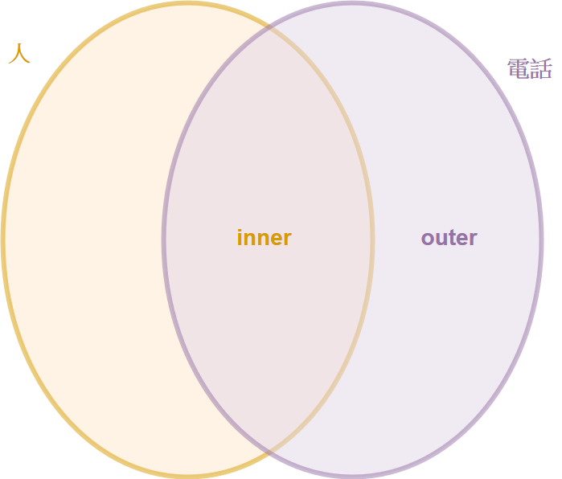

# Join的應用

在資料表的設計中我們會將資料分門別類，例如說人的資料是一張表，電話是一張表，然後會有一個ID關聯兩張表，這時我們如果要找某個人有哪些連絡電話，就會使用到`Join`的語法來合併人及電話的資料，藉此找到此人對應的聯絡電話。

**LINQ**中也有`Join`這個方法，是要如何使用呢? 讓我們一起來看看吧。

## 功能說明

設定`Outer`及`Inner`兩個資料型別物件，再將兩個型別中對應**對方的屬性**訂出來，最後決定輸出的資料結構，取得目標資料。

## 方法定義

`Join`有兩個公開方法如下:

```C#
public static IEnumerable<TResult> Join<TOuter, TInner, TKey, TResult>(
    this IEnumerable<TOuter> outer,
    IEnumerable<TInner> inner,
    Func<TOuter, TKey> outerKeySelector,
    Func<TInner, TKey> innerKeySelector,
    Func<TOuter, TInner, TResult> resultSelector);

public static IEnumerable<TResult> Join<TOuter, TInner, TKey, TResult>(
    this IEnumerable<TOuter> outer,
    IEnumerable<TInner> inner,
    Func<TOuter, TKey> outerKeySelector,
    Func<TInner, TKey> innerKeySelector,
    Func<TOuter, TInner, TResult> resultSelector,
    IEqualityComparer<TKey> comparer);
```

下面依序解說每個參數的意義:

* `outer`: 要收束的資料
* `inner`: 期望`outer`要有的資料
* `outerKeySelector`: 跟`inner`有關聯的屬性
* `innerKeySelector`: 跟`outer`有關聯的屬性
* `resultSelector`: 目標資料
* `comparer`: `inner`跟`outer`關聯屬性的**等值比較器**

我們用剛剛提到的**人**跟**電話**的例子來看，**我們要找到某個人的電話**，可以畫成下面的這張圖:



可以看到因為我們的目標是特定**人**的**電話**號碼，所以**人**是`inner`，而**電話**是`outer`，但是因為LINQ的`Join`方法是**Inner Join**，如果想要找的人沒有電話資訊，那個人的資料也不會出現，因此圖片的人的圓圈才會畫到外面。

## 查詢運算式

依據[C# Spec](https://docs.microsoft.com/zh-tw/dotnet/csharp/language-reference/language-specification/expressions#query-expressions)，我們可以看到`join`的定義如下:

```C#
join_clause
    : 'join' type? identifier 'in' expression 'on' expression 'equals' expression
    ;
```

這個定義看不出個所以然，那我們用`Northwind`裡的資料來寫個例子:

> 找出所有有訂單的客戶聯絡人姓名

```C#
from c in Customers
join o in Orders on c.CustomerID equals o.CustomerID
select c.ContactName
```

可以轉為下面的方法寫法:

```C#
Customers
   .Join (
      Orders,
      c => c.CustomerID,
      o => o.CustomerID,
      (c, o) => c.ContactName
   )
```

* `outer`: `Customers`
* `inner`: `Orders`
* `outerKeySelector`: `Customers.CustomerID`
* `innerKeySelector`: `Orders.CustomerID`
* `resultSelector`: `Customers.ContactName`

有了這個例子就清楚多了，`from`指定的是`outer`，而`join`指定的是`inner`，後面的`equals`是`inner`及`outer`關聯屬性的設定。

接著我們就可以來看運算式及方法的轉換公式了。

下面是運算式:

```C#
from x1 in e1
join x2 in e2 on k1 equals k2
select v
```

可以被轉為:

```C#
( e1 ) . Join( e2 , x1 => k1 , x2 => k2 , ( x1 , x2 ) => v )
```

## 方法範例

範例資料結構如下:

```C#
class Person
{
    public string Name { get; set; }
}

class Phone
{
    public string PhoneNumber { get; set; }
    public Person Person { get; set; }
}
```

範例資料如下:

```C#
Person Peter = new Person() { Name = "Peter" };
Person Sunny = new Person() { Name = "Sunny" };
Person Tim = new Person() { Name = "Tim" };
Person May = new Person() { Name = "May" };

Phone num1 = new Phone() { PhoneNumber = "01-5555555", Person = Peter };
Phone num2 = new Phone() { PhoneNumber = "02-5555555", Person = Sunny };
Phone num3 = new Phone() { PhoneNumber = "03-5555555", Person = Tim };
Phone num4 = new Phone() { PhoneNumber = "04-5555555", Person = May };
Phone num5 = new Phone() { PhoneNumber = "05-5555555", Person = Peter };
```

下列範例採用上面資料來演繹。

### 找出人名跟電話號碼的對應資料

```C#
Phone[] phones = new Phone[] { num1, num2, num3, num4, num5 };
Person[] persons = new Person[] { Peter, Sunny, Tim, May };

var results = persons.Join(
    phones,
    person => person,
    phone => phone.Person,
    (person, phone) => new { name = person.Name, phoneNumber = phone.PhoneNumber });

foreach (var result in results)
{
    Console.WriteLine($"{result.name}: {result.phoneNumber}");
}

/*
 * output:
 *
 * Peter: 01-5555555
 * Peter: 05-5555555
 * Sunny: 02-5555555
 * Tim: 03-5555555
 * May: 04-5555555
 */
```

這裡我們注意到它的順序是依照`outer`的順序排序的，如果同一個`outer`有**複數**個`inner`資料，才會依照`inner`順序排列。

### Join是Inner Join

我們將`Person`及`Phone`的資料各拿掉一個，會是互相有對應到的資料才會輸出。

```C#
Phone[] phones = new Phone[] { num1, num2, num3, num4, num5 };
Person[] persons = new Person[] { Peter, Sunny, Tim, May };

IEnumerable<Person> skipPersons = persons.Skip(1);
var results = skipPersons.Join(phones,
                person => person,
                phone => phone.Person,
                (person, phone) => new { name = person.Name, phoneNumber = phone.PhoneNumber });

/*
 * output:
 * Sunny: 02-5555555
 * Tim: 03-5555555
 * May: 04-5555555
 */

IEnumerable<Phone> skipPhones = phones.Skip(1);
var results = persons.Join(skipPhones,
                person => person,
                phone => phone.Person,
                (person, phone) => new { name = person.Name, phoneNumber = phone.PhoneNumber });

/*
 * output:
 * Peter: 05-5555555
 * Sunny: 02-5555555
 * Tim: 03-5555555
 * May: 04-5555555
 */
```

### 客製比較器

現在有一個奇怪的需求: **姓名最後一個字母相同的話電話可以共用**。

我們試試用客製比較器來完成:

```C#
var results = persons.Join(phones,
                person => person,
                phone => phone.Person,
                (person, phone) => new { name = person.Name, phoneNumber = phone.PhoneNumber },
                new CustomComparer());
...
class CustomComparer : IEqualityComparer<Person>
{
    public bool Equals(Person x, Person y)
    {
        return x.Name.TakeLast(1).FirstOrDefault() == y.Name.TakeLast(1).FirstOrDefault();
    }
    public int GetHashCode(Person obj)
    {
        return obj.Name.TakeLast(1).FirstOrDefault().GetHashCode();
    }
}

/*
 * output:
 * Peter: 01-5555555
 * Peter: 05-5555555
 * Sunny: 02-5555555
 * Sunny: 04-5555555
 * Tim: 03-5555555
 * May: 02-5555555
 * May: 04-5555555
 */
```

我們可以看到`Sunny`跟`May`因為最後一個字母都是`y`，所以他們所對應的電話都有對方的號碼。

## 特別之處

* 是延遲執行的方法
* 輸出資料的排序會是先`outer`再`inner`
* 沒有傳入客製比較器，則用`Default`比較器

## 結語

`Join`因為是Inner Join，所以對於要拿取的資料來說，inner及outer是沒有差別的，但是剛剛提到的排序就會有差別，如果對排序有需求的資料還是要小心使用。

## 範例程式
[GitHub](https://github.com/peterhpchen/DigDeeperLINQ/tree/20_HowToUseJoin/demo/20_HowToUseJoin)

## 參考

* [Microsoft Docs-join-operations](https://docs.microsoft.com/zh-tw/dotnet/csharp/programming-guide/concepts/linq/join-operations)
* [Microsoft Docs-system.linq.enumerable.join](https://docs.microsoft.com/zh-tw/dotnet/api/system.linq.enumerable.join?view=netframework-4.7.1)
* [Microsoft Docs-language-specification/expressions#query-expressions](https://docs.microsoft.com/zh-tw/dotnet/csharp/language-reference/language-specification/expressions#query-expressions)