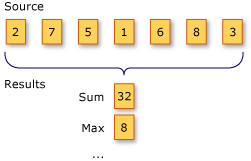

# Aggregate的應用

這次要說的`Aggregate`這個方法是在做**彙整**的處理，彙整資料之後可以幫我們找出很多本來看不清的數據，所以`Aggregate`這個方法的用法及實作也是很重要的，我們一起來看看吧。

## 功能說明

以下圖為例(節錄自[Microsoft Docs](https://docs.microsoft.com/en-us/dotnet/csharp/programming-guide/concepts/linq/aggregation-operations)):



以下說明圖片:

* `Source`是一個數字陣列
* `Results`有兩種: `Sum`跟`Max`
    * `Sum`: 加總`Source`的元素數值
    * `Max`: `Source`元素數值的最大值

由圖示我們可以知道`Aggregate`會對一個集合的內容整理後輸出成一個資料。

## 方法定義

`Aggregate`有**三個公開方法**，我們由單純到複雜來說明:

### 第一個方法

```C#
public static TSource Aggregate<TSource>(
    this IEnumerable<TSource> source,
    Func<TSource, TSource, TSource> func);
```

* `func`: 彙整資料所做的處理函式
* `func`第一個傳入參數: 之前元素的彙整結果
* `func`第二個傳入參數: 目前元素的資料
* `func`的回傳值: 之前元素跟目前元素的彙整結果

由此可以看出來`Aggregate`這個方法其實就是把**之前元素的彙整資料跟目前的元素做彙整**，再將目前彙整的結果丟到下一個元素再做彙整，最後就會得到一個彙整的結果。

### 第二個方法

```C#
public static TAccumulate Aggregate<TSource, TAccumulate>(
    this IEnumerable<TSource> source,
    TAccumulate seed,
    Func<TAccumulate, TSource, TAccumulate> func);
```

* `seed`: 初始的累加值
* `func`: 彙整資料所做的處理函式

這個方法多了一個`seed`參數，他是**自定義的初始值**，這個值會傳入`func`中，變為第一個`func`的傳入參數，以用來做彙整。

### 第三個方法

```C#
public static TResult Aggregate<TSource, TAccumulate, TResult>(
    this IEnumerable<TSource> source,
    TAccumulate seed,
    Func<TAccumulate, TSource, TAccumulate> func,
    Func<TAccumulate, TResult> resultSelector);
```

這個方法跟上一個方法的差別只有`resultSelector`這個參數，他會在巡覽結束得到彙整資料的時候去叫用`resultSelector`去產生結果。

## 方法範例

這次的範例我們會用`Aggregate`來實作不同的彙整處理(`Average`、`Count`、`Max`、`Min`、`Sum`)，範例中會有一行註解程式碼，它的結果跟我們輸出的結果相同。

### 範例資料

```C#
int[] Source = new int[] { 2, 7, 5, 1, 6, 8, 3 };
```

### Sum

```C#
private static int Sum(IEnumerable<int> source)
{
    //return source.Sum(x => x);
    return source.Aggregate((total, next) => total + next);
}
```

`total`會是之前**所有元素的加總**，所以每次叫用`func`時都是在加上**目前的數字**。

### Min

```C#
private static int Min(IEnumerable<int> source)
{
    //return source.Min(x => x);
    return source.Aggregate((min, next) => min > next ? next : min);
}
```

每次都去比對目前的元素是否**小於**目前的**最小值**，如果是的話就更新最小值。

### Max

```C#
private static int Max(IEnumerable<int> source)
{
    //return source.Max(x => x);
    return source.Aggregate((max, next) => max < next ? next : max);
}
```

每次都去比對目前的元素是否**大於**目前的**最大值**，如果是的話就更新最大值。

### Count

```C#
private static int Count(IEnumerable<int> source)
{
    //return source.Count();
    return source.Aggregate(0, (count, next) => ++count);
}
```

以**0**為起始彙整資料，每個元素都累加**1**。

### Average

```C#
private static double Average(IEnumerable<int> source)
{
    int count = 0;

    //return source.Average(x => x);
    return source.Aggregate(
        0,
        (total, next) =>
        {
            total = total + next;
            count++;
            return total;
        },
        total => (double)total / count
    );
}
```

累加元素並對外部變數`count`加**1**，最後用`resultSelector`取得**平均**資料。

範例的結果如下:

```C#
/*
 * Source: 2,7,5,1,6,8,3
 *  Average: 4.57142857142857
 *  Count: 7
 *  Max: 8
 *  Min: 1
 *  Sum: 32
 */
```

## 特別之處

* **沒有延遲執行**的特性，一旦叫用會馬上觸發

## 結語

這次的`Aggregate`只要了解`func`中兩個傳入參數: **累加值**跟**目前元素值**就可以理解他的運用方法了，搭配不同的彙整處理的例子又更加的明確，下一章我們來看看`Aggregate`的原理。

## 範例程式

* [GitHub](https://github.com/peterhpchen/DigDeeperLINQ/tree/28_HowToUseAggregate/demo/28_HowToUseAggregate)

## 參考

* [Microsoft Docs-aggregation-operations](https://docs.microsoft.com/en-us/dotnet/csharp/programming-guide/concepts/linq/aggregation-operations)
* [Microsoft Docs-system.linq.enumerable.aggregate](https://docs.microsoft.com/en-us/dotnet/api/system.linq.enumerable.aggregate?view=netframework-4.7.1)